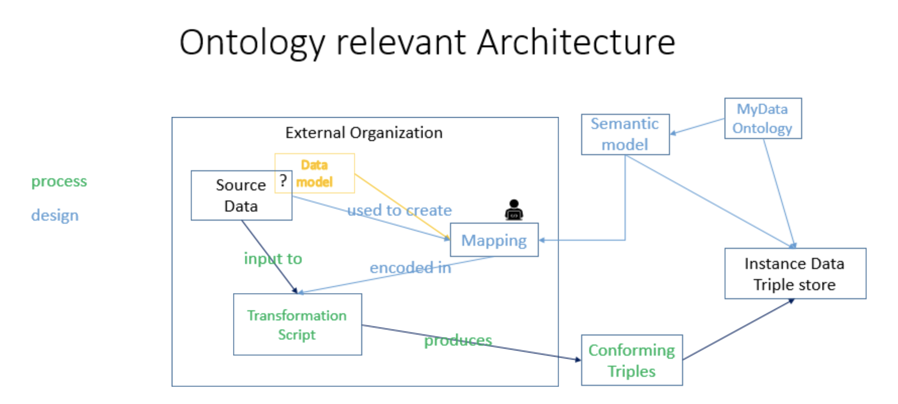

# My Data Ontology
> The My Data Ontology (MDO) is a standards-based data format for the individual, which allows uniquely formed data from vendors to be transformed into this common format and better utilized by the individual.  MDO is an extension of the [Common Core Ontologies (CCO)](https://github.com/CommonCoreOntology/CommonCoreOntologies) that provides a standardized extensible semantics for representing personal data, such as that found in a user profile or wallet. As an extension of CCO, MDO also inherits and re-uses [Basic Formal Ontology (BFO)](https://github.com/BFO-ontology/BFO), an ISO international standard, and [OBO Relation Ontology](https://github.com/oborel/obo-relations). Use of the methodology and standards derived from CCO, BFO, and RO, provides an integration layer for personal data that enables a transparent and unified semantics across domains and applications.

 
 
## How Vendors can Map their Data Models to the My Data Ontology
1. Start with your data source and data model (if available) and select the attributes of interest to your users.
2. Categorized all the attributes of the data model into a table. See example below:

    | Data Model   | Attributes              | Example Data Value |
    | ------------ | ----------------------- | ------|
    | My Navigation App | Toll Preference | Avoid Tolls |
    | My Navigation App | License Plate # | DTA 1234 |  
    | Investopedia | Full Name               | John Doe |
    | Investopedia | Social Security Number  | 123 456 7890 |
    | Investopedia | Driver’s license Number      | S1234567898765 |
    | Investopedia | Mailing address         | 21 Main St., Roosevelt Island, New York, NY, US |
    | Investopedia | Credit card Number | 2837362289292992 |
    | Investopedia | Passport Expiration Date    | 2024-08-30 |

3. Using the [My data ontology](https://github.com/I-AM-project/my-data-ontology/blob/master/MyDataOntology.ttl), create an ontological representation for all the attributes in the data model. Add the represention to the table. Below is an example for the first row. 

    | Data Model Source   | Attributes | My Data Ontology Representation                                   |
    | ------------ | ---------- | ----------------------------------------------------------------- |
    | Investopedia | Full Name  | cco:Person, cco:designated_by, cco:PersonName, cco:has_value |

4. Complete the process until all the attributes have a corresponding representation. 
   
For reference, view the mydata.org [mapping](https://github.com/I-AM-project/my-data-ontology/blob/master/dev/mapping-mydata_org-mdo.csv) 
